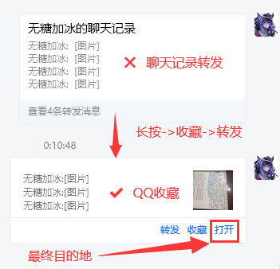
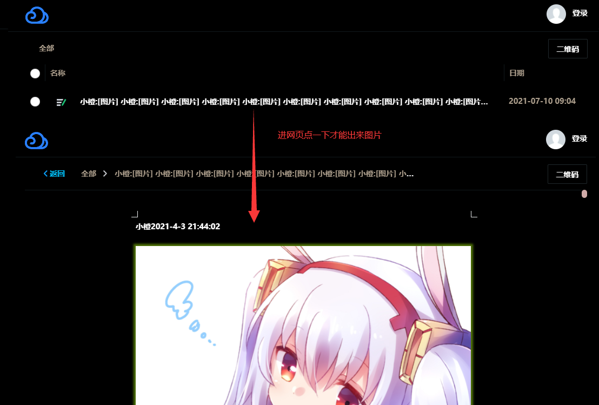

<!--
 * @?: *********************************************************************
 * @Author: Weidows
 * @Date: 2021-07-06 19:42:41
 * @LastEditors: Weidows
 * @LastEditTime: 2022-02-25 18:45:41
 * @FilePath: \awesome-image-collector\README.md
 * @Description:
 * @!: *********************************************************************
-->

<h1 align="center">

⭐️ Awesome-Image-Collector ⭐️

</h1>

# 功能

1. 自动搜集下载页面中指定图片集, `手累度`: O(n) -> O(1) 尤其在数十上百张图片场景下格外舒服.

2. `解决一般插件无法下载的隐性原始图片`,可通过插件实现跨域资源获取,不会缩放转码,无 base64 中间态.

3. 获取图片后`自动后台打包`为 Zip 文件,免得蹦出几十条下载链接.


# 使用

- 1.入口文件为: [index.js](./index.js) ,TODO 处为函数入口.

- 2.需要完成筛选图片标签部分代码 (根据复杂度不同,代码量从 1~n 行不等)

  比如下面实现中的 SM.MS-collector,只需要这一行代码就可以完成筛选:

  ```
  imageElements = document.getElementsByClassName("fancybox")
  ```

  至于筛选出标签集合之后怎么 start,如何灵活使用,可参考 [implements/SM.MS-collector.js](./implements/SM.MS-collector.js)

- 3.补充完成这部分代码之后,复制粘贴到目标网页的 console,然后回车运行即可.

---

- 4.如果遇到下面报错,是因为源站后台没有开启 CORS (反爬),`需要安装浏览器插件` : [CORS Unblock](https://microsoftedge.microsoft.com/addons/detail/cors-unblock/hkjklmhkbkdhlgnnfbbcihcajofmjgbh?hl=zh-CN) / [Allow CORS: Access-Control-Allow-Origin](https://microsoftedge.microsoft.com/addons/detail/allow-cors-accesscontro/bhjepjpgngghppolkjdhckmnfphffdag?hl=zh-CN)

  ```
  Access to image at 'xxx' from origin 'xxx' has been blocked by CORS policy: No 'Access-Control-Allow-Origin' header is present on the requested resource.
  ```


# 实现

## [SM.MS-collector](./implements/SM.MS-collector.js)

> [文档地址](https://weidows.github.io/post/tools/SM-MS-downloader) | [备用文档地址](https://weidows.gitee.io/post/tools/SM-MS-downloader)

---

## [QQ-collections-collector](./implements/QQ-collections-collector.js)

- <details>

    <summary> -> 适用于下载 QQ 收藏中的图片集 (需要安装浏览器插件) <- </summary>

  

  

  </details>

---

## [暴力爬虫](./implements/violent-collector.js)

- 硬核爬取下载网页内所有图片 (如有不想要的图需要后期手动删掉)


# 参考

> [JsZip](https://stuk.github.io/jszip/)

> [renzhezhilu/webp2jpg-online](https://github.com/renzhezhilu/webp2jpg-online/blob/917e1e527a8811f710b2a670d7771468908e4ca1/version/v1.0.0/js/index.js)
